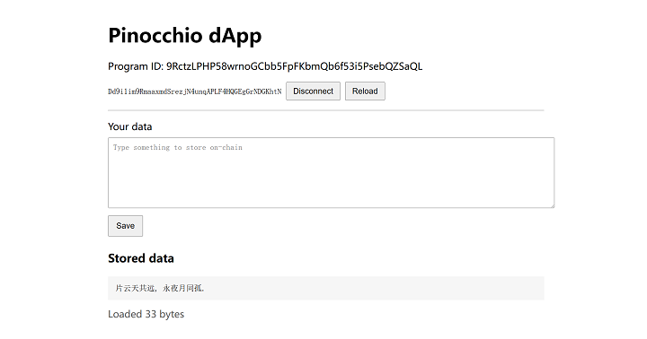

# Pxsol simple storage with Pinocchio

A simple data storage contract that allows anyone to store data on the chain.

This is an [Pinocchio](https://github.com/anza-xyz/pinocchio) version of [pxsol simple storage](https://github.com/mohanson/pxsol-ss).

## Local development

Deployed on the local test chain:

```sh
$ python make.py deploy
# 2025/05/20 16:06:38 main: deploy program pubkey="T6vZUAQyiFfX6968XoJVmXxpbZwtnKfQbNNBYrcxkcp"
```

```sh
# Save some data.
$ python make.py save "The quick brown fox jumps over the lazy dog"

# Load data.
$ python make.py load
# The quick brown fox jumps over the lazy dog.

# Save some data and overwrite the old data.
$ python make.py save "片云天共远, 永夜月同孤."
# Load data.
$ python make.py load
# 片云天共远, 永夜月同孤.
```

## On Solana mainnet

This program is deployed on Solana mainnet at:

```txt
9RctzLPHP58wrnoGCbb5FpFKbmQb6f53i5PsebQZSaQL
```

You can use the [web dApp](./web) to connect your Phantom wallet and store arbitrary data on-chain.

```sh
$ cd web
$ npm install
$ npm run dev
# Open http://localhost:5173
# Connect Phantom wallet and save/load data.
```



# License

MIT.
